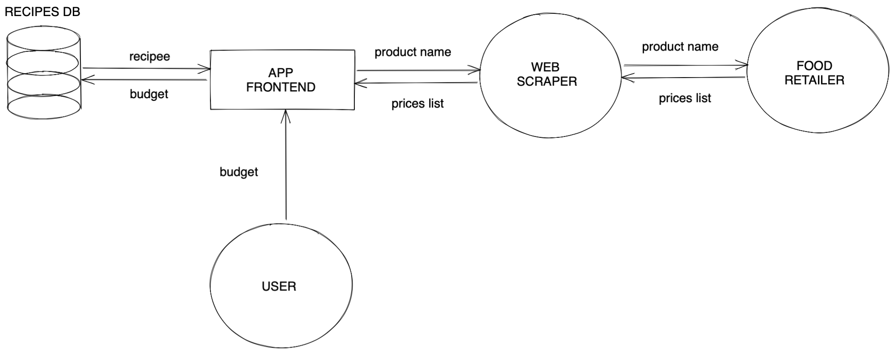

# ideat

Project to retrieve recipes idea below your budget.

## Project architecture

## Infos about orchestrator use

### Use exemple :

    int budget = 100;
    Map<String, String> params = {
        "numberMax": "1",
        "name": "",
        "cookingTime": "129",
        "recipeDiffuculty": "EASY",
        "recipeType": "platprincipal"
    };

    dynamic recipes = await searchRecipes(params, budget);

### Parameters available :

You can add the parameters you want.

#### numberMax

The maximum number of recipes you want. You can get one or two recipes maximum. If you get too many recipes at the same time, the product webscraper will stop working.

#### name

The words contained in the recipe title. Be careful, use a one word title otherwise it reduces matching chances.

#### cookingTime

The time needed to cook the recipe. It should be a positive number.

#### recipeDifficulty

Available fields :

- 'EASY'
- 'MEDIUM'
- 'HARD'
- 'VERY_HARD'

#### recipeType

Available fields :

- "conseil"
- "boisson"
- "confiserie"
- "dessert"
- "platprincipal"
- "sauce"
- "accompagnement"
- "entree"

#### recipePrice

Available fields :

- 'CHEAP'
- 'EXPENSIVE'
- 'MEDIUM'
